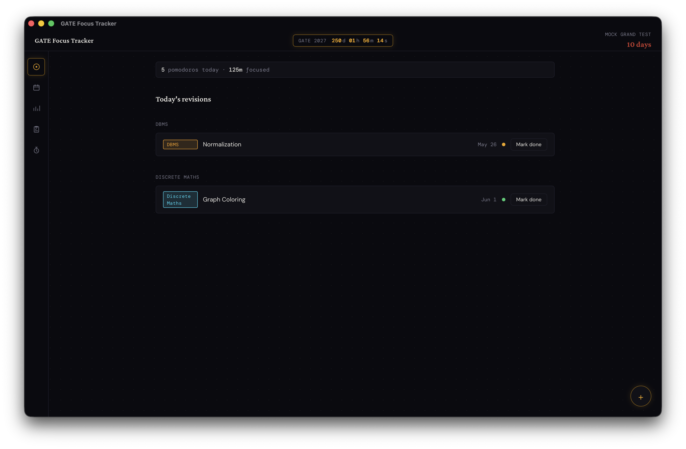
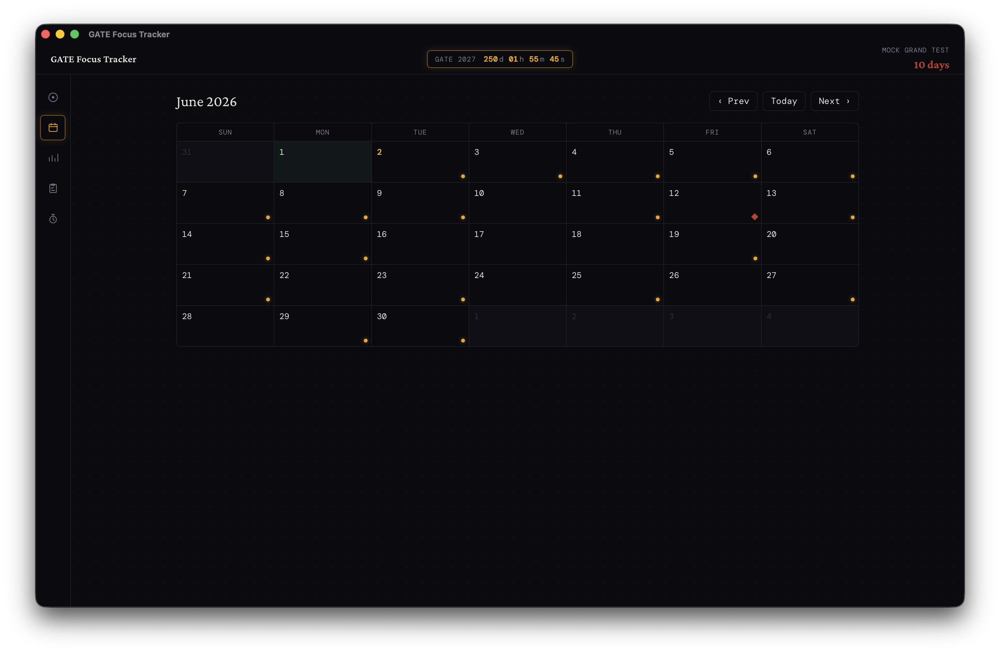
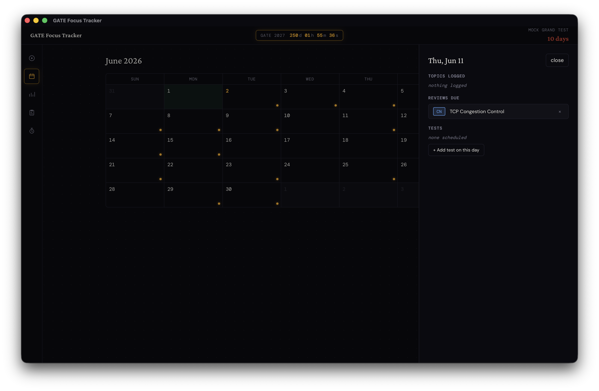
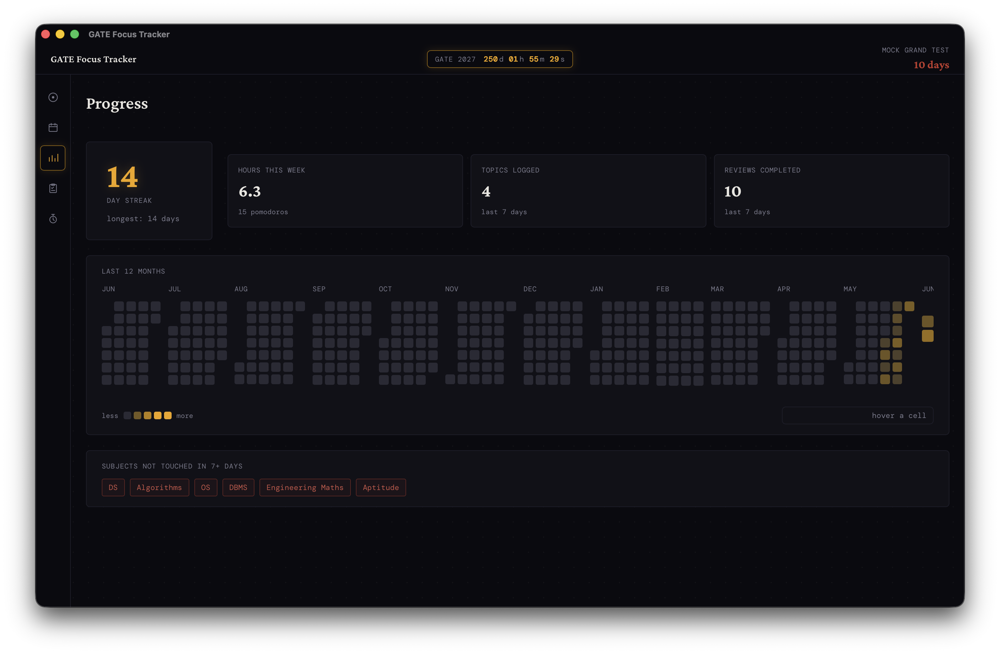
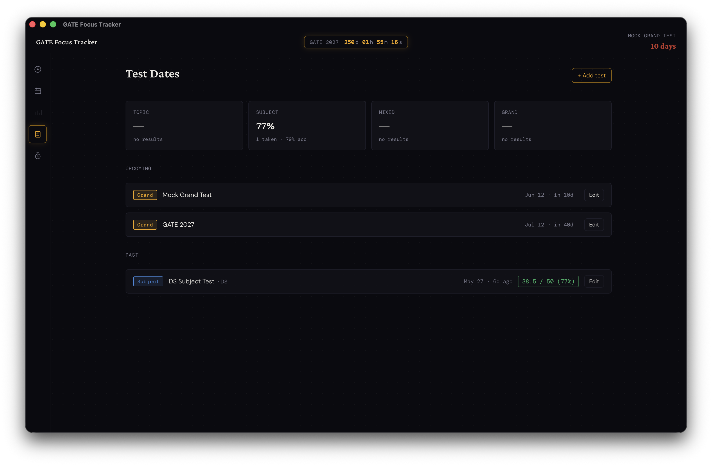
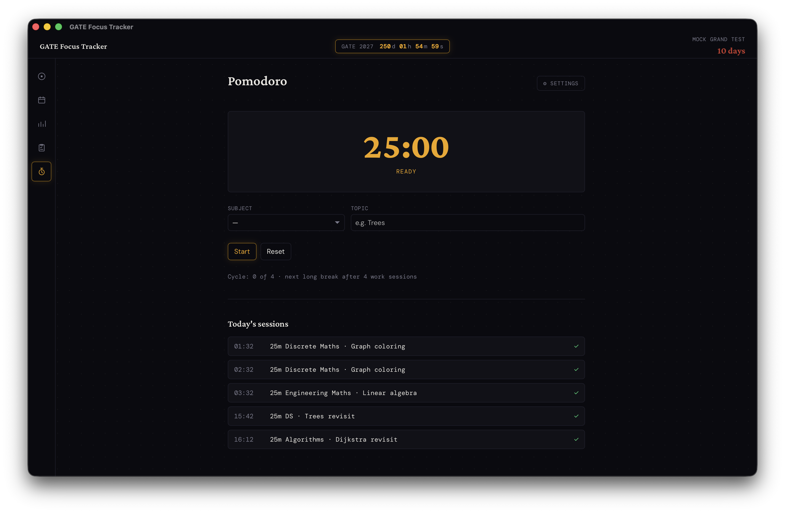

# GATE Focus Tracker

An offline-first desktop study tracker built for GATE (and any focused exam-prep) workflow. Log what you study each day, let a 1–4–7–14–30 spaced-repetition schedule resurface it, run pomodoro focus sessions, and watch the heatmap fill in.

Everything lives in a single local SQLite file on your machine — no accounts, no cloud, no analytics.

---

## Tech Stack

| Layer | Choice |
|---|---|
| Shell | [Tauri v2](https://v2.tauri.app) (Rust core + system webview) |
| Backend | Rust + [rusqlite](https://github.com/rusqlite/rusqlite) (bundled SQLite) |
| Frontend | React 18 + TypeScript + [Vite](https://vitejs.dev) |
| State | [Zustand](https://github.com/pmndrs/zustand) |
| Styling | CSS Modules (no Tailwind / UI framework) |
| Dates | [date-fns](https://date-fns.org) |
| Notifications | `tauri-plugin-notification` v2 |

The Rust crate (`backend/`) embeds `schema.sql` at compile time and runs it on every startup with `CREATE TABLE IF NOT EXISTS`, so there are no migration files to manage.

---

## Features

- **Today** — surface every spaced-repetition review due today, grouped by subject; log new topics from a floating `+` sheet; see today's topics and pomodoro focus minutes at a glance.
- **Calendar** — month grid with markers for due reviews (amber dot, red when overdue), completed days, and scheduled tests (red diamond). Click any day for a side panel of topics / reviews / tests, with delete affordances on each row.
- **Progress** — streak hero, 3 weekly stat cards (hours / topics / reviews), and a 12-month GitHub-style heatmap. Hours are sourced exclusively from completed pomodoro sessions; cell hover shows the day's totals.
- **Tests** — track upcoming and past tests (Topic / Subject / Mixed / Grand). Log marks after taking a test; per-type averages render at the top.
- **Pomodoro** — dedicated 5th page with configurable work / short-break / long-break durations and a long-break cadence. Live timer keeps ticking across page navigation; sidebar shows a pulsing amber dot whenever a session is active. Optional native desktop notification on phase end.
- **Spaced repetition** — every topic logged automatically gets 5 reviews queued at `+1`, `+4`, `+7`, `+14`, `+30` days.

## Screenshots

| Today | Calendar | Day detail |
|---|---|---|
|  |  |  |

| Progress | Tests | Pomodoro |
|---|---|---|
|  |  |  |


---

## Installation & macOS Troubleshooting

If you download the pre-compiled `.dmg` from the GitHub Releases page on macOS, you will likely see a warning stating:
> **"GATE Focus Tracker" is damaged and can't be opened. You should move it to the Bin.**

This occurs because the application is not code-signed with a paid ($99/year) Apple Developer Account. 

### How to bypass this:
1. Drag the **GATE Focus Tracker** app into your **Applications** folder.
2. Open your Terminal and run the following command:
   ```bash
   xattr -d com.apple.quarantine /Applications/GATE\ Focus\ Tracker.app
   ```
3. Open the app normally.

---


## Quick Setup (for contribution)

### Prerequisites

- **Node** ≥ 20 + npm
- **Rust** stable (`rustup`)
- **Tauri v2 platform prerequisites**:
  - macOS: Xcode Command Line Tools (`xcode-select --install`)
  - Windows: [Microsoft C++ Build Tools](https://visualstudio.microsoft.com/visual-cpp-build-tools/) + [WebView2 runtime](https://developer.microsoft.com/en-us/microsoft-edge/webview2/) (preinstalled on Win 11)
- **Tauri CLI**: `cargo install tauri-cli --version "^2.0.0"`
- **sqlite3 CLI** (only needed if you want to run the seed/clean scripts)
  - macOS: preinstalled
  - Windows: `winget install SQLite.SQLite`

### Clone & run

```bash
git clone https://github.com/Lokesh-Kudipudi/myGatePrep.git
cd myGatePrep
npm --prefix frontend install
cargo tauri dev --manifest-path backend/Cargo.toml
```

The first `dev` boot takes a minute (Rust compile). Subsequent runs are near-instant.

### Build a release bundle

```bash
cargo tauri build --manifest-path backend/Cargo.toml
```

Outputs land in `backend/target/release/bundle/` — `.dmg` / `.app` on macOS, `.msi` / `.exe` on Windows.

### Seed / clean the local database

The SQLite file lives at:
- macOS: `~/Library/Application Support/com.personal.gate-tracker/gate_prep.db`
- Windows: `%APPDATA%\com.personal.gate-tracker\gate_prep.db`

| Action | macOS / Linux | Windows |
|---|---|---|
| Wipe the DB | `./scripts/clean-db.sh` | `pwsh scripts/clean-db.ps1` |
| Seed sample data | `./scripts/seed-db.sh` | `pwsh scripts/seed-db.ps1` |

The seed script inserts 8 topics (each with 5 reviews), 23 pomodoro sessions across the last two weeks, and 3 test entries — enough to populate every screen with realistic data.

### Project layout

```
backend/        Rust + Tauri (commands, schema.sql, capabilities)
frontend/       React + Vite source
docs/           PRD, design brief, schema, API contracts, flow
scripts/        seed-db / clean-db (bash + powershell)
.github/        CI workflows
```

### Day-to-day workflow

Regular commits and PRs **don't** trigger CI — iterate locally with `cargo tauri dev` and push freely. Builds run only on `v*` tag pushes or a manual **Actions → Run workflow** trigger.

### Cutting a release

1. Bump the version in three places so they stay in sync:
   - `backend/Cargo.toml` → `version = "0.2.0"`
   - `backend/tauri.conf.json` → `"version": "0.2.0"`
   - `frontend/package.json` → `"version": "0.2.0"`
2. Commit and push the bump:
   ```bash
   git add backend/Cargo.toml backend/tauri.conf.json frontend/package.json
   git commit -m "chore: bump to 0.2.0"
   git push
   ```
3. Tag and push the tag — the tag **must** start with `v`:
   ```bash
   git tag v0.2.0
   git push origin v0.2.0
   ```
4. Watch the **Actions** tab — two matrix jobs (macos-aarch64, windows-x86_64) run for ~5–10 min each.
5. When both are green, head to the **Releases** tab. You'll find a **Draft** release `GATE Focus Tracker v0.2.0` with `.dmg`, `.msi`, and `.exe` files attached. Edit → write release notes → **Publish release**.

### Testing the pipeline without releasing

**Actions** tab → **build** workflow → **Run workflow** button → pick a branch → **Run workflow**. This produces downloadable workflow artifacts but skips the GitHub Release step.

### Recovering from a failed tagged build

1. Delete the draft release on GitHub (if one was created)
2. Delete the tag locally and remotely:
   ```bash
   git tag -d v0.2.0
   git push --delete origin v0.2.0
   ```
3. Fix the code → commit → push → re-tag → push the tag

### Quick reference

| What you want | What you do |
|---|---|
| Run locally | `cargo tauri dev --manifest-path backend/Cargo.toml` |
| Build locally | `cargo tauri build --manifest-path backend/Cargo.toml` |
| Reset DB | `./scripts/clean-db.sh` (or `pwsh scripts/clean-db.ps1`) |
| Seed sample data | `./scripts/seed-db.sh` (or `pwsh scripts/seed-db.ps1`) |
| Ship a release | Bump version → commit → `git tag vX.Y.Z && git push origin vX.Y.Z` → publish draft |
| Test CI without releasing | Actions tab → Run workflow manually |

### CI internals

[`.github/workflows/build.yml`](.github/workflows/build.yml) defines a matrix that builds release bundles for **macOS (Apple Silicon)** and **Windows (x86_64)**. Bundles are uploaded as per-platform workflow artifacts on every run; `v*` tag runs additionally create a draft GitHub Release with the same bundles attached.


## Status

Solo project, built for personal GATE 2027 prep. Issues and PRs welcome but I may move slowly on them.
